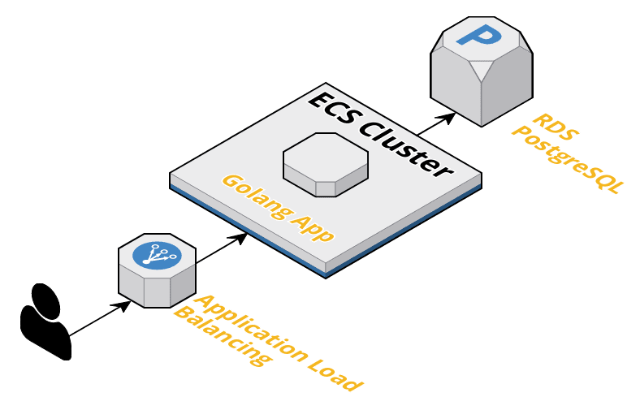

# Docker Container DevOps Project

Contains code to build the infrastructure and deploy a containerized golang webapp to AWS ECS Fargate with PostgreSQL backend.

## Features

* GitHub Actions workflow for deployment of new container versions
* Full secrets management in GitHub and AWS for AWS API Keys, Docker Hub credentials and database connection string
* Terraform based IaC to deploy infrastructure
  + Ended up only using this for deploying PostgreSQL RDS for sake of time
  + Uses git pre-commit hooks to automatically perform linting, formatting and static code analysis
* Uses AWS services to host application
  + ECS Fargate for containers
  + RDS for database
  + ALB for load balancer
* Zero downtime deployments with ECS Fargate rolling upgrades

## Potential Improvements

* Use remote state for terraform
* Automate DB restores
* Add multi-region redundancy for DB and containers
* Add actual CI steps, no testing of any kind since currently using prepackaged dockerfile.
  + Could use github actions for testing or something like AWS codebuild integrated in github workflow.
* Use separated designed IAM credentials for IaC, github actions and other actions with least privilege permission scoping.
* Add TLS to everything, both for external ingress and for connectivity between ECS and RDS.
* Use Red/Green deployment strategy instead of basic one.
* Setup VPC peering between RDS and ECS.

## Misc Notes

* Used pg_restore to restore database dump. Added security group ACL for ingress from my IP. Certainly wouldn't be best practice for real environment.
